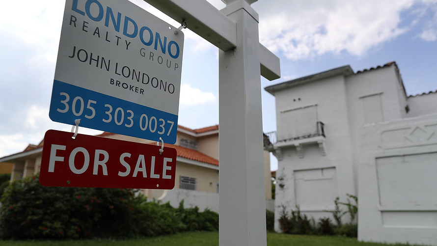
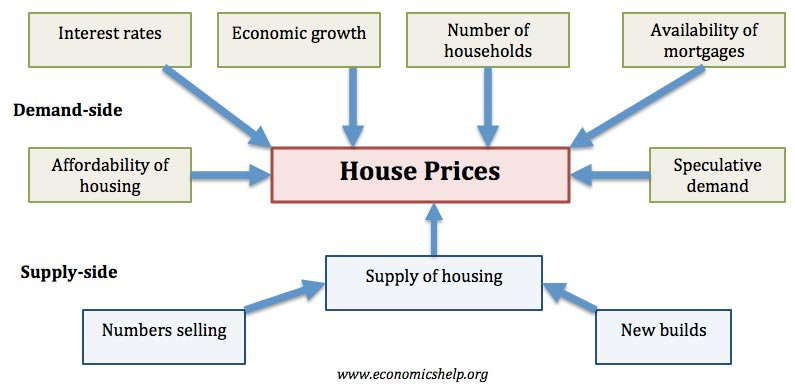
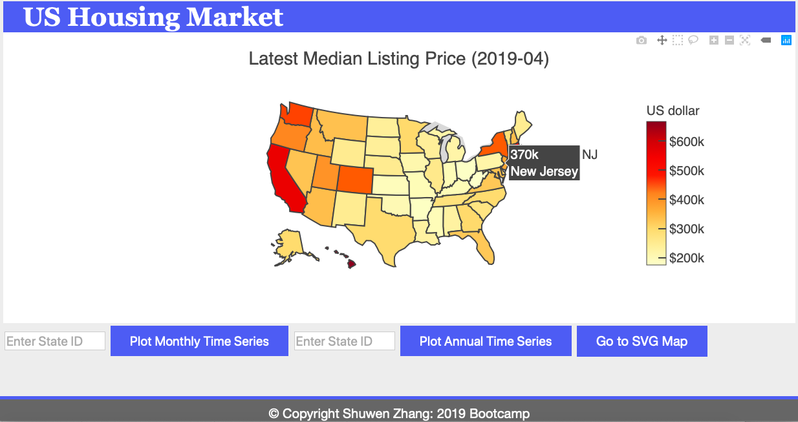
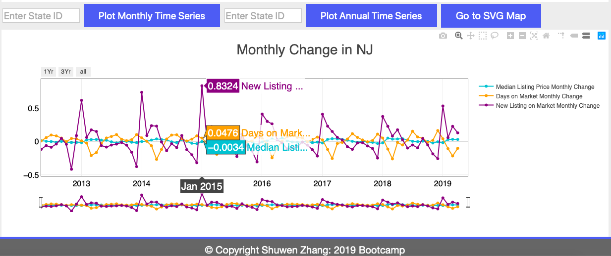
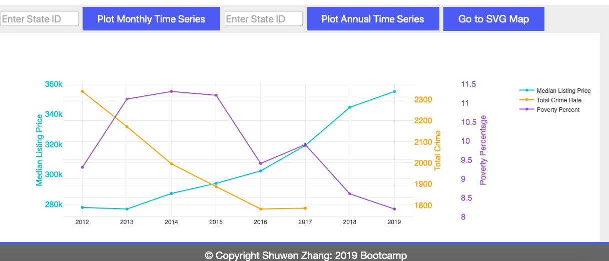
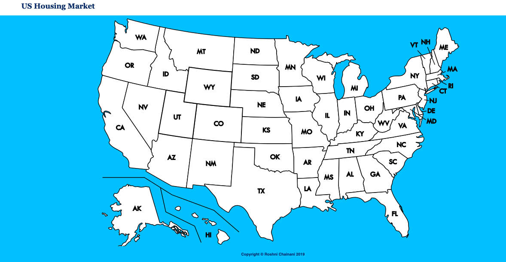

# US_Housing_Market   
### https://shuwen0529.github.io/US_Housing_Market/

# Background
The housing market is influenced by the state of the economy, interest rates, real income and changes in the size of the population. As well as these demand-side factors, house prices will be determined by available supply. With periods of rising demand and limited supply, we will see rising house prices, rising rents and increased risk of homelessness.

The above mentioned factors are catogorized as **'Intrinsic factors'**. There are also important **'Extrinsic factors'** influence house prices, such as the convenience of public transportation, schools nearby has high reputations, the quality of life, the technology trigged increase of house price like in Silicon Valley; the crime rate; the cost of living like utility, the immigration of population, etc.

# Objective
+ What is the geographic distribution of the median house price over the U.S.?
+ How do the intrinsic factors in market-side, demand-side, supply-side influence median house price in a selected state?
+ How do the ranks of median house price in a state related to the extrinsic factors?

# Data Gathering and Processing
+ Monthly residential data by states, including 33 variables during 2012-2019 in csv and JSON files (https://www.realtor.com/research/data/). We use python pandas to aggregate variables needed for this project, including median house prices, days on the market, new listing houses.
+ Annual poverty percentage by states from United States Census Bureau in csv files. (https://www.census.gov/data/tables/2018/demo/income-poverty.html).
+ Crime rate (property crime and violent crime) from FBI Uniform Crime Reporting Statistics (https://ucr.fbi.gov/crime-in-the-u.s).
+ Population change in each state from United States Census Bureau (https://www.census.gov/library/visualizations/2018/comm/population-change-2017-2018.html. We use PostgreSQL to process the data.
+ State ranking from CNBC https://www.cnbc.com/id/100016697. The data is updated every year, we scrapped and aggregated a few extrinsic factors that ranking in each state from 2010 with postgreSQL.

# Data Visualization
### Part I 
A dashboard is created with D3.js, Plotly.js and jQuery.The choropleth map presents the median house price over the US in Apr 2019. When you hover on a specific state, the price shows up. The highest prices occur in Hawaii and California. 

 

### Part II
The monthly and annual time series are incorporated in the dashboard by creating the submit buttons. If you input a state ID and click to plot time series, you will get montly and annual plots during 2012-2019. Here we use NJ as an example:

**Monthly Time Series**

By hover on the peak of the purple line, which is 'New Listing on Market', you will see the peaks occur each year in January, indicating it is good timing to search for houses since the most new houses are listed each year. Similarly, fowling the yellow line, low values occur in March/April each year, indicating the house listed on the market is sold very fast than other months.

**Annual Time series**

You will see the house price in NJ keeps increasing from 2012 to 2019. On the contrary, the crime rate and the poverty percentage present overall decrease trends. It is possible that the safer and richer the state is, the more expensive the house will be.

### Part III 
A SVG map is created and can be accessed by click the 'Go to SVG Map' button on the dashboard. 

Before moving on to the next step, you need to open your terminal, go to "/assets/nodejs/" and run "node index.js" to build scalable network applications. Then, you can click on the state and being directed to a new page of state deatils. 

As above-mentioned, Hawaii has the highest median house price in Apr 2019. Here we use Hawaii as an example to illustrate state details:

(images/Hawaii_StateDetails1.png)

## Interest Rate
Left panel: The house interest rate presents a shape of "W" from 2011 to 2018, this doesn't correlate to the general increase of house purchase rate.

## Demography
Generally speaking, the population in Hawaii is increasing (Right Panel 1), with more details of birth and death number given in Right Panel 3, 4; moreover, more people are moving out since 2011 (Right Panel 2). Thus, the increasing population in Hawaii tends to result in the increasing house price.

(images/Hawaii_StateDetails2.png)
## Other extrinsic factors
The ranking of education, economy, quality of life, cost of living in Hawaii over the 51 U.S. states are given above. It looks like the quality of life in Hawaii remains best since 2015 and cost of living keeps lowest here. These two factors are very important to attract people to settle down in Hawaii and buy a house.

### If you want to see more details of a state you want to buy a house, please click [HERE](https://shuwen0529.github.io/US_Housing_Market/) to play!
